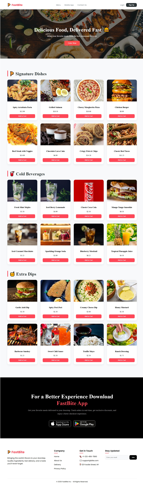
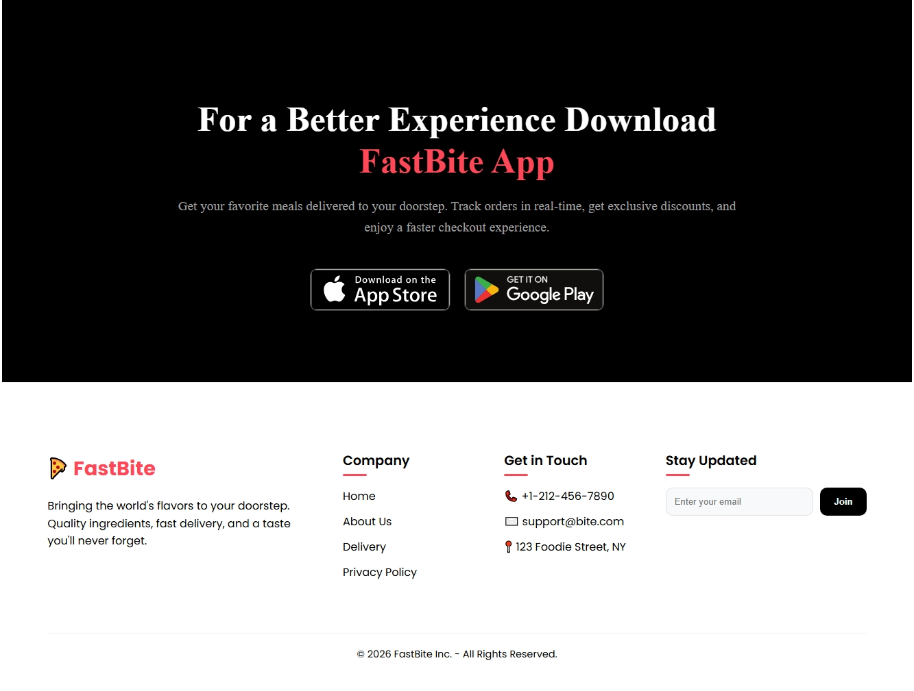

# 🍕 Food Delivery App

A full-stack food delivery application built with React.js and Node.js. Users can browse dishes, add them to cart, and place orders. Features user authentication with persistent cart storage per user.

## ✨ Features

### 👤 User Authentication
- Login and Signup functionality
- Secure password handling
- Session management

### 🛒 Smart Cart System
- **User-specific carts** - Each user has their own cart
- **Persistent storage** - Cart saves automatically and loads when user logs back in
- Real-time quantity updates
- Cart badge shows total items

### 🎨 Beautiful UI
- Glass-morphism navbar design
- Smooth scrolling navigation
- Active section highlighting
- Fully responsive (mobile, tablet, desktop)
- Modern color scheme with red accents

### 📱 Pages/Sections
- **Hero Section** - Welcome banner with call-to-action
- **Menu/Cart Page** - Browse and add dishes
- **Mobile App Section** - App download information
- **Footer** - Contact and additional links

## 🛠️ Technologies Used

### Frontend
- **React.js** - UI library
- **CSS3** - Styling with modern features
- **LocalStorage API** - Persistent cart storage
- **React Hooks** - State management (useState, useEffect, useRef)

### Backend
- **Node.js** - Runtime environment
- **Express.js** - Web framework
- **MongoDB** - Database
- **JWT** - Authentication (if implemented)

## 📂 Project Structure
